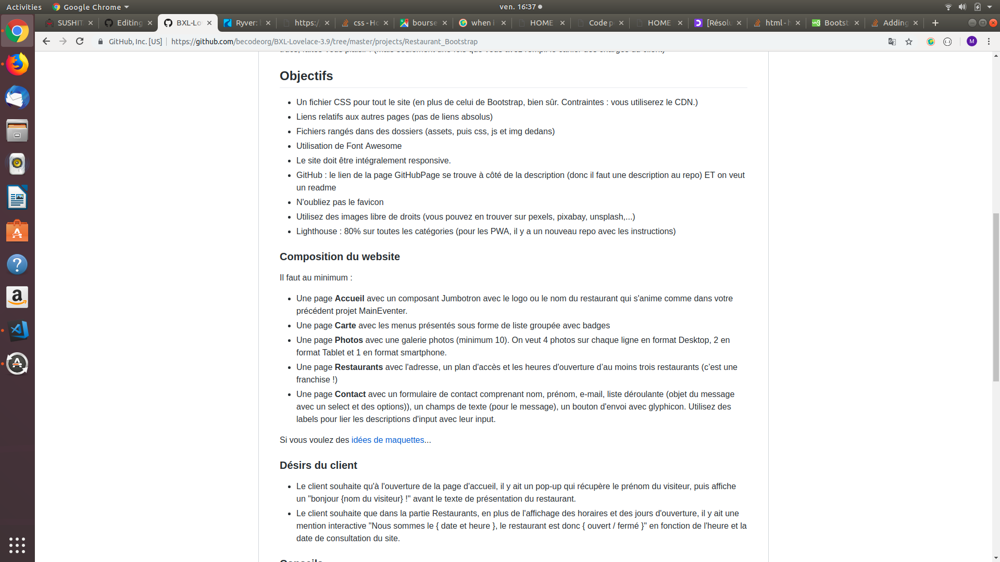

# bootstrap-resto-website

## Time-line
Exercice realised after seven weeks of training.

## Exercise Instructions:
We had four days to create a restaurant's website, that website got 5 pages (home, restaurants, menu, photos and contact), each of these pages got specific instructions. Here they are.

 
## Text Editor:
Visual Studio Code

## Langages:
- HTML
- CSS 
- Java-script
- Bootstrap

## Responsive? 
Of course!

## Issues
Unfinished project, can still be upgrade.
